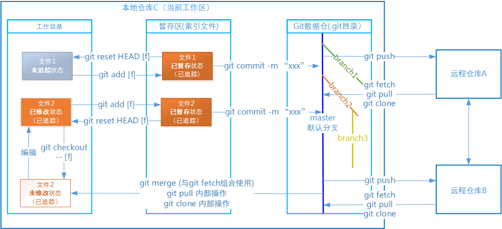
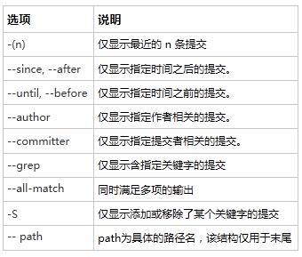
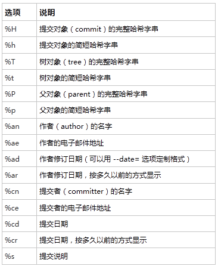

# git基础教程 

---
## 1.1 Git基础
### 1.1.1 Git项目的三个工作区域
+ Git仓库 repository 
> Git 用来保存项目的元数据和对象数据库的地方。 这是 Git 中最重要的部分，从其它计算机克隆仓库时，拷贝的就是这里的数据。
+ 工作目录 work directory
> 对项目的某个版本独立提取出来的内容。 这些从 Git 仓库的压缩数据库中提取出来的文
> 件，放在磁盘上供你使用或修改。
+ 暂存区 staging area
> 一个文件，保存了下次将提交的文件列表信息，一般在 Git 仓库目录中。 有时候也被称作`‘索引’'，不过一般说法还是叫暂存区域

### 1.1.2 Git中文件的三种状态
+ 已提交 commited 
> 数据已经安全的保存在本地数据库中
+ 已修改 modified
> 表示修改了文件，但还没保存到数据库中
+ 已暂存 staged
> 表示对一个已修改文件的当前版本做了标记，使之包含在下次提交的快照中

### 1.1.3 Git环境配置与git config命令
Git 自带一个 git config 的工具来帮助设置控制 Git 外观和行为的配置变量。 这些变量存储在三个不同的位置。

+ /etc/gitconfig
> + 包含系统上每一个用户及他们仓库的通用配置。 
> + 如果使用带有 **--system** 选项的 git config 时，它会从此文件读写配置变量。
+ ~/.gitconfig 或 ~/.config/git/config 文件
> + 只针对当前用户。
> + 可以传递 **--global** 选项让 Git 读写此文件。
+ .git/config 
> + 当前使用仓库的 Git 目录中的 config 文件, 针对该仓库
> + 不需要传递任何选项。

以上三处配置从上至下会被下一个配置覆盖。

#### 1.1.3.1 用户信息
+ `git config --global user.name "John Doe"`    //姓名 
+ `git config --global user.email johndoe@example.com`  //邮箱

#### 1.1.3.2 文本编辑器
+ `git config --global core.editor emacs` //缺省配置为系统默认的文本编辑器，通常为vim

#### 1.1.3.3查看配置信息
+ `git config --list`   //列出全部配置信息，重复信息已最后一次为准
+ `git config [key]`    //查看特定项配置，如user.name

### 1.1.4 获取帮助
+ `git help [verb]` //如:git help config 
+ `git [verb] --help`
+ `man git [verb]`

---

## 2.1 获取 Git 仓库(repository)
+ 在现有目录或目录下导入已有文件到Git中
+ 从服务器上克隆一个现有的Git仓库

### 2.1.1 本地初始化Git仓库
+ `git init `   //仅初始化一个仓库并未对文件跟踪
+ `git add [files]` //跟踪文件

### 2.1.2 克隆远程仓库
支持http、git、ssh、本地地址等协议

+ `git clone [url]` //克隆远程仓库（几乎所有数据）到本地
+ `git clone [url] [local-name]` //克隆远程仓库并命名
---

## 2.2 记录每次更新到仓库
**工作目录**的文件有两类状态，已跟踪、未跟踪。
**已跟踪**的文件有三种子状态，已修改、未修改、已暂存。

+ 已跟踪
+ 已修改、未修改、已暂存
+ 未跟踪

### 2.2.1 检查当前文件状态
+ `git status`  //
+ `git status --short`  or `git status -s`  //状态简览 

### 2.2.2 跟踪新文件
+ `git add [files]` //开始跟踪新文件files

### 2.2.3 暂存已修改文件
+ `git add [files]`    //暂存修改的文件files

### 2.2.4 忽略文件 .gitignore
+ 所有空行或者以 ＃ 开头的行都会被 Git 忽略。
+ 可以使用标准的 glob 模式匹配。
+ 匹配模式可以以（/）开头防止递归。
+ 匹配模式可以以（/）结尾指定目录。

+ 要忽略指定模式以外的文件或目录，可以在模式前加上惊叹号（!）取反。

### 2.2.5 查看修改
+ `git diff`    //查看当前文件与暂存区的区别
+ `git diff --staged`   //查看已暂存需要下次提交的内容（--cached老用法）

### 2.2.6 提交更新
+ `git commit`  //启动编辑器输入相应的修改批注
+ `git commit -m "modified xxx` //-m后为提交信息
+ `git commit -a -m "modified xxx"` //暂存、提交一起完成。

### 2.2.7 移除文件
+ `git rm [file]` //将未修改文件，文件将从暂存区、工作目录删除，在commit后将从Git仓库中移除。
+ `git rm -f [file]`    //将已修改文件或者已暂存未提交，-f强制删除
+ `rm [file]`   //仅从工作目录中删除，需要追加git rm才能从暂存区删除，在commit后从git仓库中删除。
+ `git rm --cached [file]`  //从暂存区中删除，保留在工作目录，进入未跟踪状态。而**git reset HEAD \[file\]只是会退到为暂存状态**

### 2.2.8 移动文件
+ `git mv [from] [to]`  //等效如下三步
> 1. `mv [from] [to]`
> 2. `git rm [from]`
> 3. `git add [to]`

---

## 2.3 查看提交历史
+ `git log` //基本查看
+ `git log -p -2` //-p 显示每次提交的内容差异, -2 最近两次提交

+ --pretty=oneline    //pretty关键字是表示偏好，oneline表示一行显示
+ --pretty=short
+ --pretty=full
+ --pretty=fuller 
+ --pretty=format:"%h - %an, %ar: %s" //自定义格式化输出

---

## 2.4 撤销操作
### 2.4.1 修改最后一次提交
+ `git commit --amend`  //重新提交

### 2.4.2 取消已经暂存的文件
+ `git reset HEAD [file]`   //撤销对文件的暂存恢复到未暂存/已修改状态 vs git add [file]

### 2.4.3 取消对文件的修改
+ `git checkout -- [file]`  //撤销对文件的修改。恢复到未修改状态。

---

## 2.5 远程仓库使用 
+ remote 作为远程仓库的代称，再没有指定名字的情况下默认用origin名。
+ branch 作为分支的代称，在没有指定名字的情况下默认用master名。

### 2.5.1 查看当前的远程仓库
+ `git remote`  //列举远程仓库的简短名
+ `git remote -v`   //显示对应的克隆地址

### 2.5.2 添加远程仓库
+ `git remote add [shortname] [url]` //给本地仓库添加一个远程的仓库引用

### 2.5.3 从远程仓库抓取数据
+ `git fetch [remote-name]` //从remote-name仓库中抓取本地没有的数据（但不合入）
+ `git pull`    //从已经被跟踪的分支中抓取数据并合入到当前分支

### 2.5.4 推送数据到远程仓库
+ `git push [remote-name] [branch-name]`    //将本地分支推送到远程仓库(remote-name)的对应分支(branch-name)

### 2.5.5 查看远程仓库信息
+ `git remote show [remote-name]` //

### 2.5.6 远程仓库的删除和重命名(本地删除)
+ `git remote rename [old-name] [new-name]`
+ `git remote rm [remote-name]`

---

## 2.6 打标签
### 2.6.1 列出已有标签
+ `git tag`
+ `git tag -l 'v-1.4'` //列出相关标签

### 2.6.2 新建标签
#### 2.6.2.1 含标注的标签(annotated)
+ `git tag -a v1.4` //-a含标注标签必须 
+ `git tag -a v1.5 -m 'version 1.5'`    //-m增加对标签的说明

#### 2.6.2.2 轻量级标签(lightweight)
+ `git tag v1.4`    //直接加标签名

### 2.6.3 显示标签的信息
+ `git show v1.4`    //显示含v1.4标签的版本信息

### 2.6.4 签署标签(GPG签署)
+ `git tag -s v1.5 -m 'my signed 1.5 tag'` //-s(signed)

### 2.6.5 验证标签
+ `git tag -v [tag-name]`   //-v(verify)验证已签署的标签

### 2.6.6 加注标签
+ `git tag -a v1.2 9fceb02` //9fceb02是待打标签对象的校验和头部

### 2.6.7 分享标签
+ `git push origin [tag-name]` //git push不会把标签推至远端，必须显示调用
+ `git push origin --tags`  //一次从推送所有本地新增标签至远端

---

## 3 branch分支
+ 示例用的分支名为**testbh**

### 3.1 创建
+ `git branch **testbh**`        //创建分支
+ `git checkout -b **testbh**`   //创建并切换分支

### 3.2 切换
+ `git checkout **testbh**`      //切换分支
+ `git checkout -b **testbh**`   //创建并切换

### 3.3 合并
+ `git checkout master `              //step1 切换到目标分支
+ `git merge **testbh**`         //step2 将testbh分支合入master分支

#### 3.3.1 合并冲突
+ `git status` //查看存在的冲突信息
+ `git mergetool` //启动可视化冲突处理工具
+ `git commit` //解决冲突后提交

### 3.4 分支管理
#### 3.4.1 删除
+ `git branch **-d** testbh`     //将**本地**testbh分支删除

#### 3.4.2 查看
+ `git log --oneline --decorate`      //查看日志中相关的分支记录
+ `git log --oneline --decorate --graph --all` //显示分支间的关系
+ `git branch -v`     //查看每个分支的最后一次提交
+ `git branch --merged` //查看合并的分支提交信息
+ `git branch --nomerged` //查看未合并的分支提交信息

#### 3.4.3 更新
+ `git fetch` //从远程仓库（此处默认的仓库为origin）中抓取本地没有的数据
+ `git fetch origin` //抓取origin仓库的数据
+ `git fetch test_repo` //从test_repo中抓取本地没有的数据
+ `git merge origin/serverfix` //将从远程fetch的serverfix分支合入当前分支
+ `git checkout -b serverfix origin/serverfix` //创建并切换至serverfix分支，合入来之远程的origin/serverfix分支
+ `git push (remote) (branch)` //往remote仓库推送本地的branch分支
+ `git push (remote) (local:dest)` //将本地的local分支推送至remote仓库中的dest分支
+ `git push --force`  //???

## 3.5 远程分支
### 3.5.1 远程仓库与分支
+ 一个仓库里包含多个分支，远程仓库的代称为remote,分支代称为branch。将**远程仓库的默认分支**拉取到本地后的引用为(remote)/(branch)结构，默认名称为origin/master。
+ 远程引用：对远程仓库的引用（指针）。
+ 远程跟踪分支：对远程分支状态的引用。 
+ `git remote`    //获得远程仓库列表
+ `git ls-remote [remote-repo]` //显示获取远程引用完整列表
+ `git remote show [remote-repo]` //获得远程分支更多信息
+ `git clone -o xxx` //克隆远程仓库并将远程仓库的默认命名改为xxx
+ `git remote add [remote-repo] [URL]` //创建新远程仓库的引用为remote-repo/master
+ `git fetch [remote-repo]`   //拉取远程仓库
+ `git fetch --all`   //
+ `git merge [remote-repo]/[remote-branch]` //将remote-branch合入当前分支

### 3.5.1 推送
+ `git push [remote-repo] [remote-branch]`   //推送到远程分支,多见于本地新分支的推送，设有跟踪分支的推送可简化为git push
+ `git push origin serverfix` //同名，将本地分支推送到远程分支severfix。
+ `git push origin serverfix:serverfix` //同名，推送本地的serverfix分支作为远程仓库的serverfix分支。
+ `git push origin serverfix:new-branch`    // 改名，推送本地的serverfix分支到远程的new-branch分支。
注意：
> 当其他用户从远程拉去仓库时(git fetch origin),本地并没有新的分支(serverfix),只有不可修改的远程分支的指针(origin/serverfix),此时有两种选择
> + 合入到当前分支：`git merge origin/serverfix`;
> + 合入到新的分支：`git checkout -b new-branch origin/serverfix`;

### 3.5.2 跟踪分支
> 从一个远程跟踪分支检出一个本地分支会自动创建一个叫做 “跟踪分支”（有时候也叫做 “上游分支”）。 跟踪分支是与远程分支有直接关系的本地分支。 如果在一个跟踪分支上输入 git pull，Git 能自动地识别去哪个服务器上抓取、合并到哪个分支。
>当克隆一个仓库时，它通常会自动地创建一个跟踪 origin/master 的 master 分支。如需更改跟踪分支，可按一下方式处理。

+ `git checkout -b [new-branch] [remote-repo]/[remote-branch]` //创建跟踪分支new-branch,将remote-branch合入到新分支[new-branch]。
+ `git checkout --track origin/serverfix`  //--track 创建新同名跟踪分支serverfix，并跟踪远程分支origin/serverfix。
+ `git branch -u origin/serverfix`   //设置本地已有分支跟踪远程分支origin/serverfix, -u等效--set-upstream-to， 之后可用@{upstream}或@{u}代替远程分支，如git merge @{u}。
+ `git branch -vv`    //查看跟踪分支列表信息，git branch -a //查看分支列表

### 3.5.3 拉取
从远程服务器上拉取数据有两种方案，git fetch; git pull
+ `git fetch origin`    //拉取数据，不修改工作目录内容。合并工作由git merge完成。
+ `git pull`    //拉取并合并等效git fetch 和 git merge。git pull会查找当前分支所**跟踪的服务器与分支**，从服务器上抓取数据然后尝试合并入那个远程分支。

### 3.5.4 删除远程分支

删除远程服务器上的分支，采用git push的 --delete选项，该操作从远程服务器上移除相应的指针，直到垃圾回收时真正删除。

+ `git push [remote-repo] --delete [remote-branch]`   //删除远程分支

## 3.6 变基
**分支合并方式：快进（fast-forward)、三方合并、变基**
+ 变基：使用 rebase 命令将提交到某一分支上的所有修改都移至另一分支上，就好像“重新播放”一样。变基使得提交历史更加整洁。一般我们这样做的目的是为了确保在向远程分支推送时能保持提交历史的整洁。
+ 基本原则：不要对在你的仓库外有副本的分支执行变基。

### 3.6.1 变基元操作
+ `git checkout testbh`   //切换到testbh分支
+ `git rebase master`     //在目标基地上进行变基操作，将testbh相对二者最近祖先的变动，作用在master上，得到新的testbh
+ `git checkout master`   //切回master
+ `git merge testbh`  //master分支快速合入

### 3.6.2 多分支变基
+ `git rebase --onto master server client`    //取出 client 分支，找出处于 client 分支和 server 分支的共同祖先之后的修改，然后把它们在 master 分支上重放一遍，得到client分支。
+ `git rebase [basebranch] [topicbranch]` //topicbranch在basebranch上变基。

### 3.6.3 变基冲突解决
+ 如果对远程仓库的依赖部分发生了变基需要进行二次变基以解决问题。
+ `git rebase [remote/branch]`    //remote/branch 为已经发生变基的依赖分支，与git fetch 连用
+ `git pull --rebase` //替代git pull 实现变基合并。

